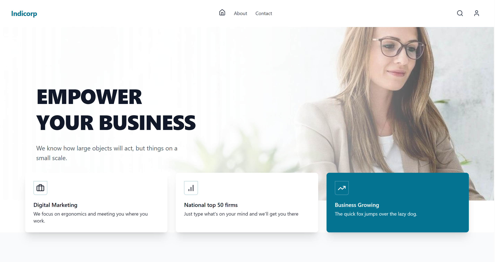
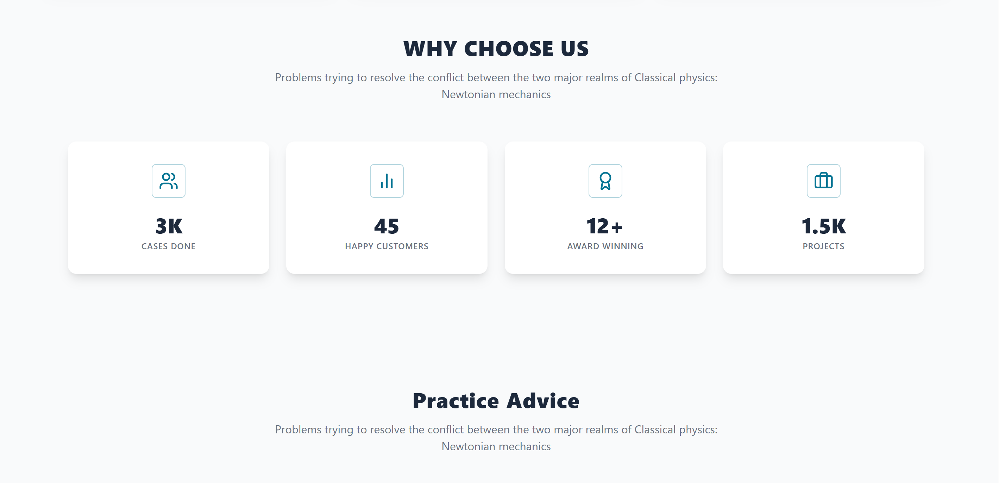
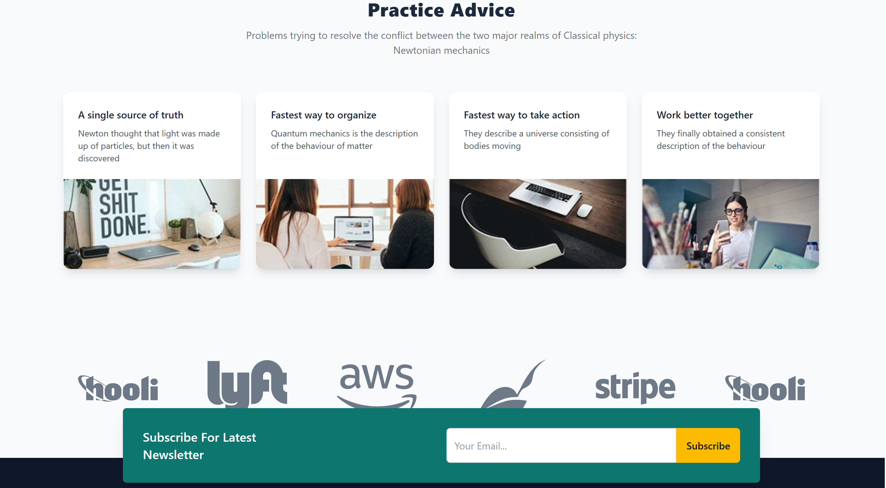
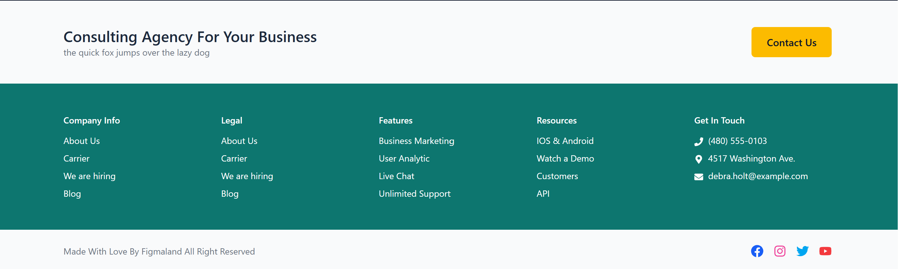

# Indicorp

A modern and responsive business landing page built with React, Vite, Tailwind CSS, and React Router.

---

## ✨ Features

- Responsive modern landing page
- Reusable React components
- Client-side routing with React Router
- Clean business-oriented UI
- Newsletter section
- About and Contact pages
- Icon integration with Lucide React and React Icons

---

## 🛠️ Tech Stack

- React
- Vite
- Tailwind CSS
- React Router DOM
- Lucide React
- React Icons

---

## 📄 Pages

- Home
- About Us
- Contact

---

## 🧩 Components

- Navbar
- Hero
- WhyChooseUs
- TipsCards
- Brands
- Footer
- About
- About2

---

## 📸 Screenshots






---

## 🚀 Getting Started

Clone the project:

```bash
https://github.com/mohammad-reza99/Indicrop.git
```
